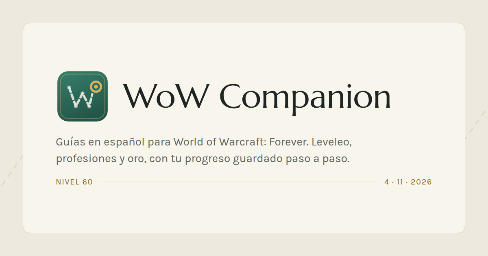

<p align="center">
  
</p>

# wow-companion

Companion en español (y en inglés) para **World of Warcraft: Forever**, la tercera rama
permanente de WoW anunciada el 12 de septiembre de 2026, con beta desde el 17 de
septiembre y lanzamiento el 4 de noviembre de 2026.

No es sólo una web de guías: el personaje del jugador está en el centro. La web muestra el
pulso del juego (qué ha cambiado, qué está abierto, cómo van los reinos) y, debajo, los dos
o tres pasos que te tocan ahora en profesión y en leveleo, calculados a partir de tu
progreso.

> Web de fans, sin afiliación ni respaldo de Blizzard Entertainment. World of Warcraft y
> Warcraft son marcas de Blizzard Entertainment, Inc.

El logo es la ruta del jugador: una traza discontinua que pasa por los puntos ya hechos y
apunta al siguiente, todavía sin alcanzar, dibujando una W. Los archivos están en
`web/public/`: `logo-mark.svg` (marca cuadrada), `logo.svg` (marca y nombre),
`logo-mark-compact.svg` (versión simplificada que sirve de icono del navegador y de
marca en la cabecera) y `og-default.png`.

## Piezas

| Carpeta            | Qué es                                                               | Estado    |
| ------------------ | -------------------------------------------------------------------- | --------- |
| `web/`             | Sitio estático en Astro 7 + TypeScript, islas de React para lo vivo  | Fase 1 ✅ |
| `api/`             | API .NET 8 Minimal API, PostgreSQL y EF Core                         | Fase 1: `/api/health` |
| `shared/contracts` | Contrato de paso y progreso en JSON Schema, generado desde Zod       | Fase 1 ✅ |
| `client/`          | App de escritorio .NET que lee los SavedVariables del addon          | Fase 8    |
| `addon/`           | Addon de WoW en Lua                                                   | Fase 7    |

## Levantar el proyecto en local

Necesitas Node 22, pnpm 10 y Docker. El SDK de .NET sólo hace falta si vas a tocar la API
fuera de contenedores.

```bash
cp .env.example .env
pnpm install
pnpm dev            # http://localhost:4321
```

Con todo el stack (web + api + postgres + proxy):

```bash
docker compose up --build   # http://localhost:8080
```

`docker-compose.override.yml` se aplica solo y publica la API en `localhost:5080` y
Postgres en `localhost:5432` para poder trabajar contra ellos sin pasar por el proxy.

### Comandos

| Comando                   | Qué hace                                                    |
| ------------------------- | ----------------------------------------------------------- |
| `pnpm dev`                | Servidor de desarrollo de Astro                              |
| `pnpm build`              | Build estático a `web/dist`                                  |
| `pnpm check`              | Formato, lint, tipos y build: lo mismo que ejecuta CI        |
| `pnpm lint` / `pnpm format` | ESLint y Prettier                                          |
| `pnpm typecheck`          | `astro check` con TypeScript en modo estricto                |
| `pnpm contracts:export`   | Regenera `shared/contracts/*.json` desde los esquemas de Zod |

## Cómo está montado

### Rutas e idiomas

El español es el idioma por defecto y va sin prefijo; el inglés vive bajo `/en/`. Los
**slugs están traducidos** porque son contenido (`/profesiones/alquimia` ↔
`/en/professions/alchemy`), y las versiones hermanas se enlazan con un `translationKey`
idéntico en el frontmatter. El mapa de slugs por idioma está en `web/src/i18n/routes.ts`;
los textos de interfaz, en `web/src/i18n/ui/`, con el español como fuente de verdad y el
inglés tipado contra él, de modo que una clave que falte rompe el build.

Astro deriva la URL del nombre del fichero, así que el árbol de rutas en español lleva
nombres en español. Para que no haya dos implementaciones, cada fichero de `web/src/pages/`
es un envoltorio de cinco líneas sobre el componente equivalente de `web/src/sections/`.

### Contenido

Las guías son colecciones de contenido con esquema Zod, agrupadas por carpeta de idioma
(`web/src/content/<colección>/{es,en}/`). Los nombres de colección, los campos y las claves
van **en inglés**; el español aparece sólo en el texto y en los slugs.

Toda entrada lleva `lang`, `translationKey`, `updated` y `confirmed`. Mientras Forever esté
en beta, `confirmed` es `false` por defecto y la ficha muestra un distintivo de «sin
confirmar»: es más barato confirmar un dato que desmentirlo.

### Contrato con el addon

`web/src/schemas/step.ts` y `web/src/schemas/progress.ts` definen el paso y el progreso una
sola vez. `pnpm contracts:export` los vuelca a `shared/contracts/` como JSON Schema, que es
lo que consumen la API y el cliente de escritorio. Los identificadores de paso son estables
y **nunca se reutilizan**: si una guía cambia, los pasos nuevos llevan ids nuevos, porque
del otro lado hay progreso guardado apuntando a ellos.

### Dato vivo sin romper el sitio estático

Las páginas se generan en build. El estado de reinos lo pide el navegador a nuestra propia
API, que cachea la respuesta de Blizzard unos minutos. Si ese endpoint falla, la página ya
está dibujada y la tarjeta dice que no hay dato: nunca un hueco roto ni un error.

## Datos de la API de Blizzard

Pendiente (fase 10). Cuando llegue, `scripts/fetch-game-data.ts` autenticará con client
credentials contra `https://oauth.battle.net/token` y volcará el resultado normalizado a
`web/src/data/*.json`, versionado en git.

**Ojo con el namespace.** Hoy la API de Blizzard sólo documenta namespaces de retail y de
los sabores Classic (`static-classic1x-{region}`, `static-classicann-{region}`…). **No hay
namespace confirmado para Forever.** Por eso el namespace se pasa por variable de entorno
(`BLIZZARD_NAMESPACE`) y hay que revisarlo en cuanto Blizzard lo publique. El sitio compila
perfectamente aunque esos JSON vengan vacíos, y así debe seguir siendo.

## Reglas que no se saltan

- No se scrapea ni se copia Wowhead, WowDB ni Icy Veins. Escribimos nuestras guías y
  enlazamos a ellos. Si algún día queremos tooltips, se usa el script oficial de Wowhead.
- Disclaimer de fan site en el pie de todas las páginas.
- Cada dato lleva su fuente, y las fichas con información de beta avisan de que puede
  cambiar.
- Nada de traducción automática publicada sin revisar: antes falta la guía y se marca como
  pendiente.

## Plan de trabajo

Una fase por rama, revisión antes de seguir.

1. **Esqueleto y novedades** ✅ — monorepo, Astro, TypeScript estricto, lint, rutas
   bilingües, diccionario, tema claro/oscuro, portada con el pulso del juego, colección
   `patches`, Docker Compose y CI.
2. Estado en vivo: endpoint cacheado de reinos y contenido abierto.
3. Motor de seguimiento local: almacenamiento, selector de personaje, lista marcable,
   próximos pasos, exportar e importar.
4. Profesiones: las doce guías 1–300 y el planificador.
5. Leveleo: zonas, ruta 1–60 y selector de nivel.
   _Hasta aquí, publicado antes del 4 de noviembre de 2026._
6. API y cuentas: Battle.net OAuth, Postgres, fusión de progreso, códigos de emparejamiento.
7. Addon: los dos modos, avance automático, pines con HereBeDragons, `addon:export`.
8. Cliente de escritorio: bandeja, vigilancia de SavedVariables, emparejamiento.
9. Oro, empezar, mazmorras y raids.
10. Datos de Blizzard: `data:sync`.
11. Mapa interactivo: SVG de zonas, zoom y marcadores ligados al progreso.
12. SEO y pulido: imágenes OG por página, datos estructurados y auditoría de Lighthouse.

Más detalle en `docs/`.
